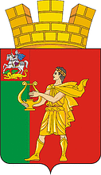

<!--2021-11-01 00:28:03-->
Город в *28* км к юго-западу от Москвы на берегу реки Десны.
В нем находится известный в прошлом бывший завод грампластинок фирмы "*Мелодия*".

   &emsp; 

  Население &emsp; ***30 000*** &emsp;
  Год основания &emsp; ***1899***

