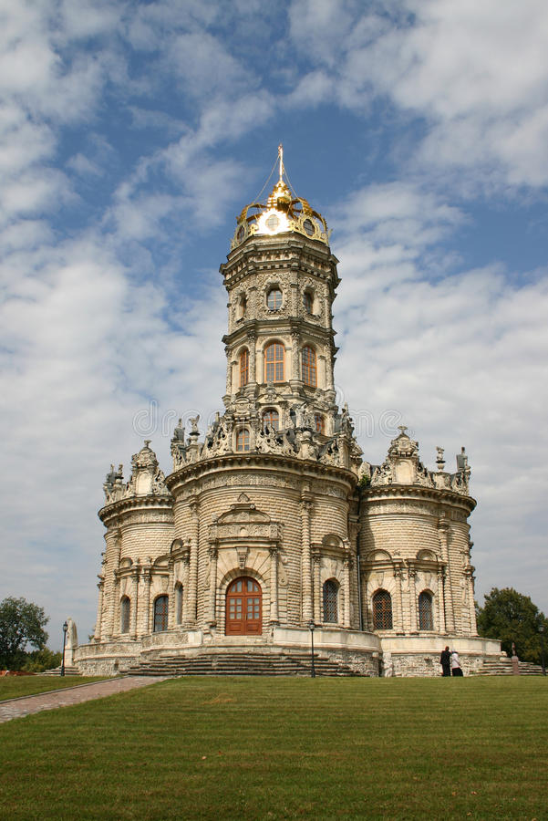

<!--2022-04-20 00:48:11-->
Посёлок в городском округе Подольск Московской области в *16* км к югу от МКАД. 
В поселке расположена старинная усадьба и Знаменская церковь *17* века.  

   &emsp; 

  Население &emsp; ***3 362*** &emsp;
  Год основания &emsp; ***1627***

