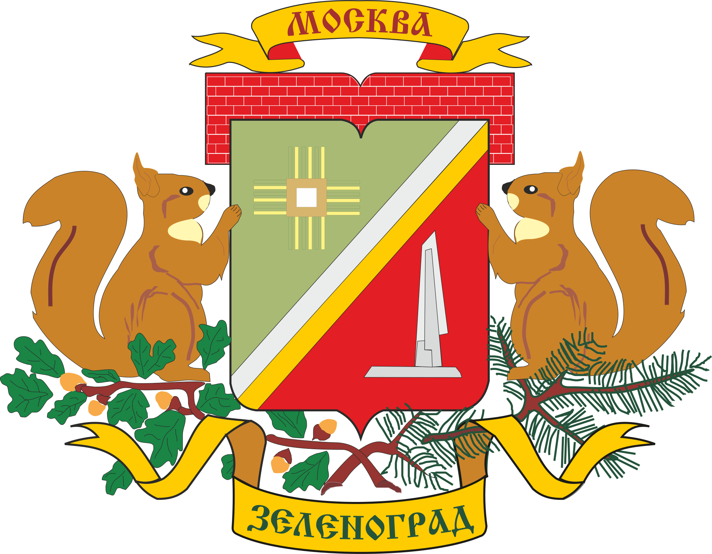

<!--2021-10-17 15:29:11-->
### Зеленоград
Город в *37* км к северу-западу от Москвы. Крупный центр микроэлектроники, российская *Кремниевая долина*.
Является самостоятельным округом (ЗелАО) в составе города Москвы.

   &emsp; 

  Население &emsp; ***250,000*** &emsp;
  Год&nbsp;основания &emsp; ***1958***

