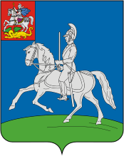

<!--2021-11-18 00:22:08-->
Подмосковный город в *60* км к западу от Москвы.
В нем расположен музей бронетанковой техники, недалеко о города расположены военный парк "*Патриот*",
военный аэродром *Кубинка*.

   &emsp; 

  Население &emsp; ***20,000*** &emsp;
  Год&nbsp;основания &emsp; ***1584***

