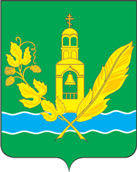

<!--2021-11-20 14:30:06-->
Город в *90* км к юго-востоку от Москвы. 
В нем расположены *Гуслицкий Спасо-Преображенский монастырь*, узловая железнодорожная станция.

   &emsp; 

  Население &emsp; ***21 000*** &emsp;
  Год основания &emsp; ***1646***

