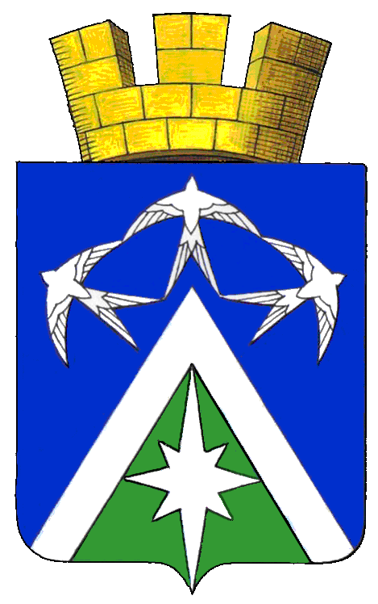

<!--2021-10-27 23:39:39-->
Город в *135* км к юго-востоку от Москвы.
Знаменит огурцами, выращиваемыми в Луховицком районе и авиационным заводом "*Миг*".

   &emsp; 

  Население &emsp; ***30,500*** &emsp;
  Год основания &emsp; ***1594***

