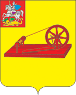

<!--2021-10-21 00:49:04-->
Город на реке Клязьме в *35* км к востоку от Москвы.
В прошлом был крупным центром российской текстильной промышленности.
На территории Ногинского района расположено несколько военных городков.

   &emsp; 

  Население &emsp; ***103 000*** &emsp;
  Год основания &emsp; ***1389***

