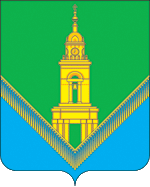

<!--2022-01-18 00:44:01-->
Город на реке Клязьме при слиянии с рекой Вохной в *65* км к востоку от Москвы.
В городе работает текстильное производство знаменитых *павлово-посадских платков*, 
расположено много старых купеческих домов и храмов.

   &emsp; 

  Население &emsp; ***63,000*** &emsp;
  Год основания &emsp; ***1328***

