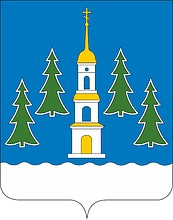

<!--2021-10-22 01:03:04-->
Город расположен в *30* км к юго-востоку от Москвы.
В черте города находится Борисоглебское озеро, названное по стоящей рядом старинной церкви *17* века.

   &emsp; 

  Население &emsp; ***123 500*** &emsp;
  Год основания &emsp; ***1628***

