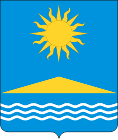

<!--2021-10-23 01:44:17-->
### Солнечногорск
Город на северо-западе Московской области в *44* км от границ Москвы на берегу Сенежского озера
Имеет почётное звание "*Населённый пункт воинской доблести*". 

   &emsp; 

  Население &emsp; ***50,000*** &emsp;
  Год&nbsp;основания &emsp; ***18 век***

