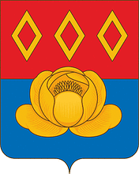

<!--2021-10-25 00:17:11-->
Город на реке Купавинка в *22* км к востоку от Москвы.
В городе располагается крупное российское фармацевтическое производство.

   &emsp; 

  Население &emsp; ***24 000*** &emsp;
  Год основания &emsp; ***1353***

