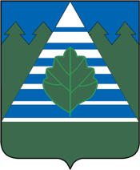

<!--2021-12-05 00:36:11-->
Город-наукоград в *20* км к юго-западу от Москвы. Вошел в *2012* году в *Троицкий административный округ* города Москвы,
поменяв статус *города* на *поселение*.
В городе располагается *Научно-исследовательский институт земного магнетизма* РАН (ИЗМИРАН).

   &emsp; 

  Население &emsp; ***61,000*** &emsp;
  Год основания &emsp; ***1617***

