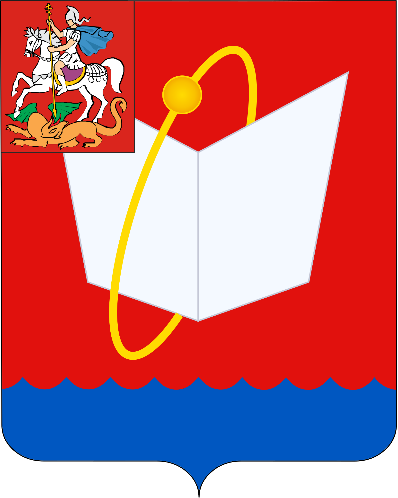

<!--2021-11-04 00:55:07-->
### Фрязино
Город-наукоград в *20* км к северо-востоку на берегу реки Любосеевка.
Российский центр СВЧ-электроники.

   &emsp; 

  Население &emsp; ***60,000*** &emsp;
  Год&nbsp;основания &emsp; ***1584***

