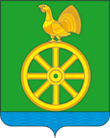

<!--2021-11-25 00:22:22-->
Посёлок городского типа в *150* км к востоку от Москвы.
Расположен в Мещёрской низменности. Считается самым холодным местом Подмосковья.

   &emsp; 

  Население &emsp; ***2,500*** &emsp;
  Год&nbsp;основания &emsp; ***1911***

